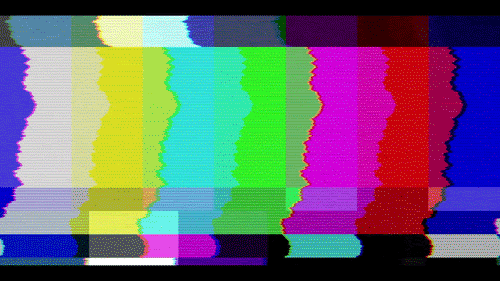
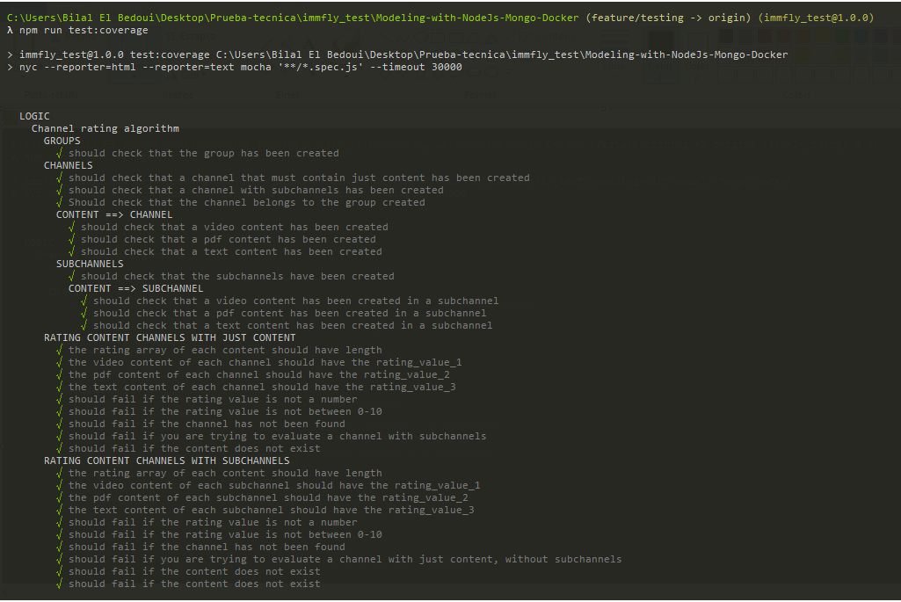
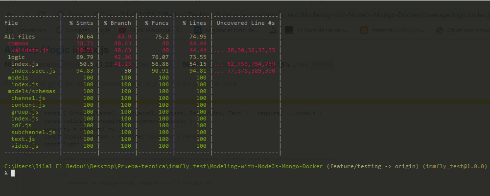

# Entertainment section with channels, subchannels, content... - Designing a clean RESTful API with Node.js (Express + Mongo + testing)




## Introduction

We want to model the Entertainment section of our platform, which displays contents following a hierarchical structure.

We organize the contents in the platform through the use of Channels. A Channel has a title, a language, a picture and might contain other subchannels within itself. In case a
channel has no subchannels associated to it, it must contain a set of contents. Contents can be files such as videos, pdfs, or text, as well as a set of arbitrary metadata
associated with the content (movie director, author, genre, etc.) and a rating value.
In the example, we follow the path:
Root → Series → Atresplayer → El club de la comedia → El club de la comedia (Chapter 1)

Contents also have a rating, which is a decimal number between 0 and 10. Channels can’t store this rating directly (because the structure can change at any time), so we
need a way to compute it from the content structure behind them. The rating of a channel is the average of the ratings of all the channels underneath, if the channel has
no subchannels, the rating is the average of the ratings of its contents.

## Getting started, Available Scripts:

Follow these steps at the command line:

### 1. Clone and Install 

```bash
git clone https://github.com/bilalelbedoui93/Modeling-with-NodeJs-Mongo-Docker

cd Modeling-with-NodeJs-Mongo-Docker

npm install
```

### 2. Start Mongo

```bash
mongod
```

### 3. Run the solution
```bash
npm run start
```
### 4. To test the API

```bash
npm run test
```

### 5. Run coverage testing

```bash
npm run test:coverage
```

## group routes

|groups                                |Method|Path          |params|body            |Returns                       |
|--------------------------------------|------|--------------|------|----------------|------------------------------|
|Add a group                           |POST  |/api/group    |      |name+description|Object: message: 'Group added'|
|Retrieve a group with all its channels|POST  |/api/group/:id|id    |                |Object: group, channels       |


## channels routes

|channels                 |Method|Path                 |body                                                |Returns                 |
|-------------------------|------|---------------------|----------------------------------------------------|------------------------|
|Add a channel            |POST  |/api/channel         |group_Ids, title, language, picture, has_subchannels|message: 'Channel added'|
|csv file with the ranking|GET   |/api/channels/average|                                                    |csv file folder root    |

## subchannels routes

|subchannels              |Method|Path        |body                                | Returns                    |
|-------------------------|------|------------|------------------------------------|----------------------------|
|Add a subchannel         |POST  |/api/channel|channel_id, title, language, picture| message: 'Subchannel added'|

## content routes

|content                    |Method|Path                          |body                                      |Returns                        |
|---------------------------|------|------------------------------|------------------------------------------|-------------------------------|
|add a video to a channel   |POST  |/api/content-video            |channel_id, type, title, author, ...      |message:'content_video added'  |
|add a pdf to a channel     |POST  |/api/content-pdf              |channel_id, type, title, author, ...      |message:'content_pdf added'    |
|add a text to a channel    |POST  |/api/content-text             |channel_id, type, title, author, text_body|message:'content_text added'   |
|rating value content       |POST  |/api/content/rating           |rating_value, channel_id, content_id      |message:'rating value added...'|
|add a video to a subchannel|POST  |/api/subchannel/content-video |channel_id, subchannel_id, type, title ...|message:'... to subchannel'    |
|add a pdf to a subchannel  |POST  |/api/subchannel/content-pdf   |channel_id, subchannel_id, type, title ...|message:'... to subchannel'    |
|add a text to a subchannel |POST  |/api/subchannel/content-text  |channel_id, subchannel_id, type, title ...|message:'... to subchannel'    |
|rating value subch. content|POST  |/api/subchannel/content/rating|rating_value, channel_id, subchannel_id...|message:'rating value added...'|

## Testing & Coverage



